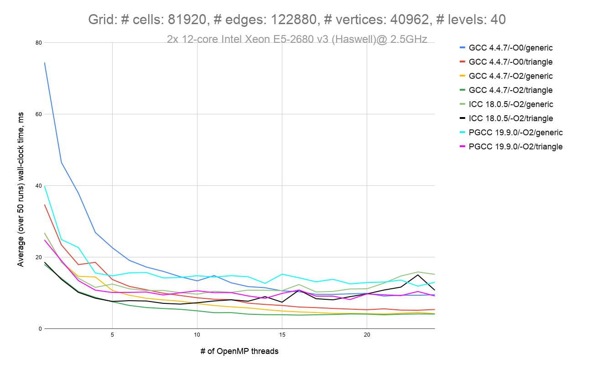

# Introduction

This repository contains [examples of algorithms](./src/basic_operators.c) that are
typical for weather and climate modelling on unstructured grids (e.g. for
[ICON model](https://code.mpimet.mpg.de/projects/iconpublic)).

# Requirements

- C99 compiler
- [Autoconf](https://www.gnu.org/software/autoconf) and
[Automake](https://www.gnu.org/software/automake) (if you build from the
repository)
- [GNU Make](https://www.gnu.org/software/make)
- [Curl](https://curl.haxx.se) (if you wish to download the
[grid files](http://icon-downloads.mpimet.mpg.de/mpim_grids.xml) automatically)
- [NetCDF-C library](https://www.unidata.ucar.edu/downloads/netcdf)

# Building and running

1. Generate the configure script and other files required for building (not
required if you are using a release tarball):
    ```bash
    ./autogen.sh
    ```
2. Configure the project:
    ```bash
    ./configure --with-netcdf=/path/to/netcdf
    ```
3. Build the executables:
    ```bash
    make -j4
    ```
4. Run the tests and benchmarks:
    
    The following command will download a grid file automatically:
    ```bash
    make check
    ```
    Alternatively, you can download one of the
    [grids](http://icon-downloads.mpimet.mpg.de/mpim_grids.xml) manually and set
    the environment variable `ICON_GRID` to the absolute path of the downloaded
    file:
    ```bash
    export ICON_GRID=/path/to/gridfile
    make check
    ```

# Benchmarks
## Divergence operator

